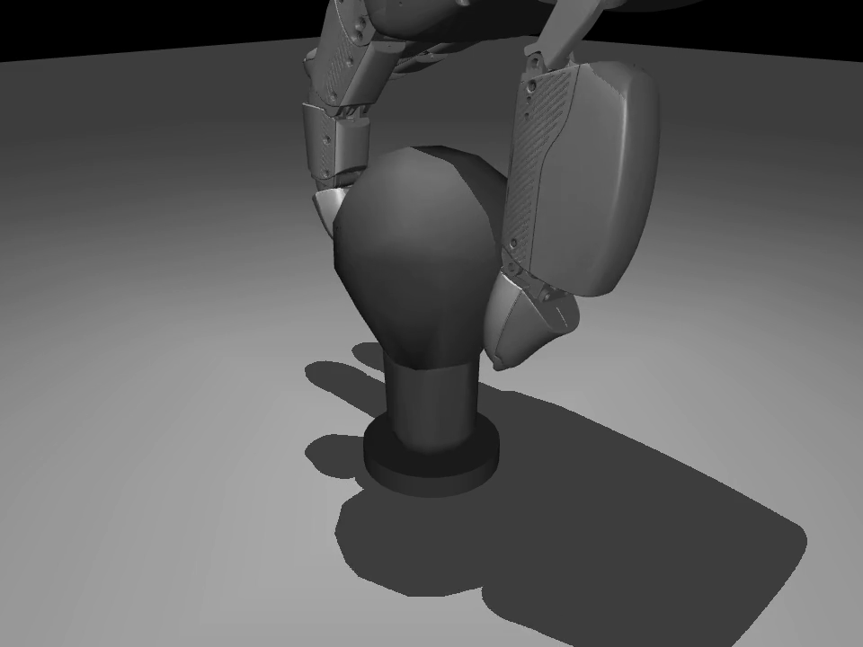

# 灵巧手精细操作仿真训练及真机迁移系统

> 产品定义稿：v0.2
> 梳理日期：2026-07-29
> 当前状态：**旋拧操作任务及 Sim2Real 链路可演示使用，通用精细操作能力待开发发布**

## 1. 设备名称：一个产品定义

### 设备名称

**灵巧手精细操作仿真训练及真机迁移系统**

### 产品定义

本产品是一套面向具身智能精细操作任务的仿真训练、策略验证和真机迁移系统。
系统以多自由度灵巧手为执行载体，以 NVIDIA Isaac Gym 为主要并行训练环境，
以 MuJoCo 为跨仿真验证环境，并提供策略导出、关节映射、控制指令生成和真机通信
参考接口，用于将仿真中获得的操作策略迁移至真实灵巧手。

产品总体目标是形成可复用的精细操作研发平台，使瓶盖开合、螺纹紧固、旋钮调节、
工具使用和手内操作等不同任务可以共享灵巧手模型、训练框架、策略接口、控制链路
和验证工具。

当前版本已经实现的首个操作任务是：

**食指与拇指协同完成灯泡头、螺纹件等对象的旋拧操作，并打通从 Isaac Gym
仿真训练、PPO/PAdapt 策略生成、策略导出，到真机部署参考运行的 Sim2Real
技术链路。**

因此，“旋拧”是当前已经实现和可演示的具体任务，不是对产品总体能力边界的限制。
瓶盖、旋钮、螺母螺栓、螺丝刀及其他精细操作任务属于同一产品平台后续扩展范围。

### 产品组成

1. **仿真训练环境**

   提供灵巧手、灯泡/螺纹件等操作对象的仿真资产，支持任务重置、接触力学、
   奖励函数、终止条件、课程配置和域随机化。当前训练环境以 Isaac Gym 为主，
   支持大规模并行环境采样。

2. **策略训练与评估模块**

   提供 PPO teacher 训练、PAdapt student 策略适配、策略评测和冻结模型管理。
   当前仓库已经包含旋拧任务的 teacher、student、任务配置和训练配置，可直接作为
   演示、评估及迁移基线。

3. **Sim2Sim 与 Sim2Real 迁移模块**

   提供 MuJoCo 场景、冻结策略运行器、Isaac Gym 参考状态回放、关节名称映射、
   动作屏蔽、目标位置积分、PD 控制和真机 SDK 部署参考。当前已经形成从仿真策略
   到外部运行时及真机控制接口的完整链路。

4. **交互、诊断与成果输出模块**

   用户通过命令行、YAML 配置和 MuJoCo Viewer 选择任务、策略与验证参数。
   系统可以输出动作、关节、目标、力矩、对象转角、接触事件、验证报告和演示视频，
   用于研发调试、教学实训、产品演示和真机迁移分析。

## 2. 设备功能参数

1. **对应载体与当前任务**

   - 主要仿真载体为 DexH13 / Pasini（也可能写作 Paxini）16 自由度右手；
   - 灵巧手包含食指、中指、无名指和拇指，每指 4 个关节自由度；
   - 当前旋拧策略主要使用食指和拇指，共 8 个有效动作自由度；
   - 中指和无名指在当前 CoDrive 两指旋拧任务中保持非主动状态；
   - 当前操作对象为灯泡头、螺纹件及其铰链约束模型；
   - 当前任务目标是使食指和拇指保持协同接触，并驱动对象绕螺纹轴连续旋转；
   - 仓库还包含螺丝刀、螺母螺栓和多种灯泡对象配置，可作为后续任务扩展基础；
   - 真机侧提供 XHand SDK、策略推理和位置目标下发参考，目标载体可根据具体
     灵巧手型号完成关节映射和标定。

2. **仿真训练与策略功能**

   - Isaac Gym 默认训练配置支持 8192 个并行环境，实际运行规模取决于 GPU；
   - 单回合长度为 800 个策略步；
   - 采用 PPO 训练具有特权信息的 teacher 策略；
   - 采用 PAdapt 生成基于本体历史信息的 student 策略；
   - 当前冻结 teacher 为
     `sim2real/codrive/best_reward_4159.37.pth`；
   - 当前主要迁移 student 为
     `sim2real/codrive/model_best_codrive.ckpt`；
   - 策略输入包含最近 3 帧展开得到的 96 维观测；
   - 本体历史长度为 30 帧，每帧由 16 维关节位置和 16 维目标位置组成，
     即 `30 × 32`；
   - 策略保留 `100 × 3` 的点云信息接口，当前 MuJoCo 基础运行可以使用零占位输入；
   - 策略输出为 16 维归一化动作，并裁剪至 `[-1, 1]`；
   - 支持对象质量、尺寸、质心、摩擦、恢复系数、PD 增益、观测噪声、
     动作噪声、初始位姿和随机外力等域随机化；
   - 当前对象质量随机范围为 0.04–0.06 kg，缩放范围约为 1.15–1.25，
     摩擦范围为 1.0–5.0，恢复系数范围为 0.0–0.05。

3. **Sim2Sim、Sim2Real 与控制参数**

   - 冻结策略运行频率为 20 Hz；
   - Isaac Gym 物理频率为 200 Hz，物理步长为 `0.005 s`；
   - 每个策略动作对应 10 个物理步；
   - MuJoCo 稳定诊断时也可使用 `0.001 s` 物理步长和 50 个子步，
     保持相同的 20 Hz 策略周期；
   - 策略动作不直接作为力矩，而是通过
     `target = prev_target + 0.05 × action` 更新关节目标位置；
   - 目标位置会裁剪到所选灵巧手的关节上下限；
   - 低层控制采用
     `tau = 3.0 × (target - q) - 0.01 × qvel` 的显式 PD 力矩控制；
   - 冻结任务配置中的力矩上限为 `±300`；
   - 当前 CoDrive 动作屏蔽索引为 `4:12`，只保留食指和拇指动作；
   - 外部推理运行时显式使用 checkpoint 中的均值和方差进行观测及历史归一化；
   - MuJoCo 支持 `audit`、`zero`、`poke`、`policy` 和
     `reference_action` 五类运行模式；
   - 支持加载 Isaac Gym 导出的重置状态和策略动作，进行同状态 sim2sim 回放；
   - 真机部署参考支持手部状态读取、关节顺序转换、策略推理、目标积分、
     关节限位和位置指令下发；
   - 当前仓库已经打通 Sim2Real 软件链路，面向具体 16 自由度 Pasini/Paxini
     真机时仍需按实际硬件完成关节顺序、零位、方向、通信和安全参数标定。

4. **用户交互与输出方式**

   - 算法工程师通过 Python 命令行和 YAML 文件选择任务、策略、场景、
     仿真频率、接触模式及输出目录；
   - 演示人员通过 MuJoCo Viewer 实时观察灵巧手执行旋拧策略；
   - 测试人员通过验证脚本对比策略动作和零动作结果；
   - 系统记录原始动作、屏蔽后动作、关节目标、关节位置、关节速度、
     PD 力矩、对象转角和接触事件；
   - 系统可以生成 CSV 轨迹、JSON 摘要、TSV 参考数据、Markdown/JSON
     验证报告和 MP4 演示视频；
   - 接触诊断可以统计食指、拇指和对象之间的接触占比、主导接触对及
     单指摩擦捷径；
   - 真机集成人员通过 XHand SDK 参考代码连接实际设备并下发关节位置目标；
   - 当前主要交互方式是工程命令行、配置文件、仿真 Viewer 和运行报告；
   - 产品化 GUI、Web 控制台、VR 遥操作界面和一键真机部署流程属于后续发布内容。

### 建议交付形态

1. Isaac Gym 仿真任务、训练代码、评估脚本和任务配置；
2. PPO teacher、PAdapt student 和策略归一化参数；
3. MuJoCo 手部/对象场景、运行器、分析器、验证器和参数扫描工具；
4. 真机 SDK、策略部署参考、说明文档、日志、报告、截图和演示视频。

## 3. 产品示意图

图中展示当前已实现的旋拧任务：DexH13/Pasini 灵巧手的食指和拇指位于
灯泡形旋拧对象两侧，MuJoCo 运行器加载冻结 PAdapt 策略后驱动对象绕铰链旋转。
该场景是本产品“精细操作任务仿真训练与迁移”的首个具体功能示例。

动态中间产物包括：

1. [`policy_rollout.mp4`](outputs/sim2sim_mujoco_hinge/video_smoke_policy_40/policy_rollout.mp4)：
   当前旋拧策略在 MuJoCo 中的短时运行视频；
2. [`DexScrew.gif`](assets/DexScrew.gif)：
   上游项目的真机旋拧任务展示，可用于说明产品的真机应用形态。

## 4. 产品状态

### 4.1 可演示使用

1. **旋拧操作任务已经实现**

   当前已经具备灯泡头/螺纹件旋拧任务的仿真资产、任务配置、训练代码、
   PPO teacher、PAdapt student、策略评估和运行产物。冻结策略能够在
   MuJoCo 中驱动旋拧对象产生明确的轴向运动。

2. **Sim2Real 技术链路已经打通**

   已经形成 Isaac Gym 仿真训练、teacher/student 策略生成、策略导出、
   外部运行时归一化、关节映射、目标积分、关节限位、位置指令下发和
   XHand SDK 通信参考链路。当前链路可以作为灵巧手真机迁移的基础版本。

3. **Sim2Sim 验证与问题诊断已经可用**

   MuJoCo 运行器可以加载冻结 PAdapt 策略，完成场景审计、零动作测试、
   单关节测试、策略闭环、Isaac Gym 参考动作回放和视频渲染。系统已经
   实现 policy/zero 对比、接触统计和反单指摩擦捷径门控。

4. **工程演示与教学输出已经具备**

   当前可以通过 MuJoCo Viewer、MP4 视频、CSV/JSON/TSV 轨迹和 Markdown
   验证报告展示策略输入输出、控制过程、对象旋转和接触行为，适合科研演示、
   课程实训、算法调试及真机集成前验证。

### 4.2 待开发发布

1. **扩展更多精细操作任务**

   在当前旋拧任务基础上，继续实现并验收瓶盖开合、旋钮调节、螺母螺栓、
   螺丝刀、工具使用、插拔和其他手内操作任务。

2. **完善 MuJoCo 行为一致性**

   当前 MuJoCo 策略控制链路已经运行，但食指和拇指的接触节奏仍未完全复现
   Isaac Gym 参考行为。需要进一步优化主动指端碰撞几何、接触模型和对象约束，
   避免单个手指持续摩擦驱动对象。

3. **完成目标真机的产品级适配**

   针对最终选定的 Pasini/Paxini 或其他灵巧手，完成关节名称与顺序确认、
   零位和方向标定、通信延迟测试、频率验证、软限位、急停、通信超时、
   过流/过力保护和安全复位，并形成标准化真机验收流程。

4. **完善用户交互和数据采集**

   增加产品化 GUI 或 Web 控制台、任务选择、一键运行、状态监控、故障提示、
   自动报告和示教数据管理。VR 遥操作和人类示教采集目前需要集成外部
   `skill-teleop` 项目或重新开发本地模块。

### 4.3 产品结论

**灵巧手精细操作仿真训练及真机迁移系统**已经完成首个旋拧操作任务，并打通
仿真训练、策略生成、跨仿真验证和真机部署参考的 Sim2Real 链路。

当前产品可围绕旋拧任务进行科研、教学和工程演示；下一阶段是在复用现有训练、
控制和迁移框架的基础上，完成更多精细操作任务、目标真机标准化适配以及
产品级人机交互功能。
